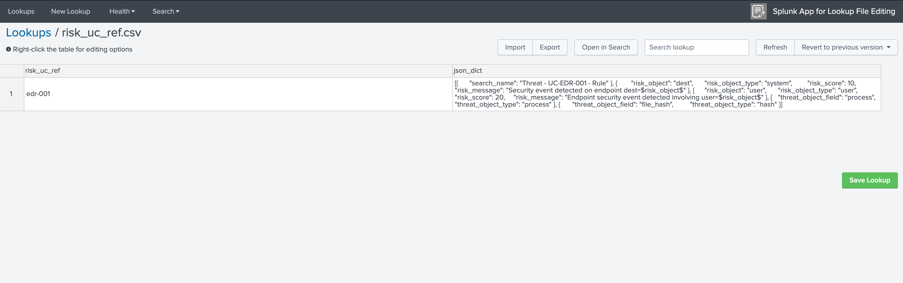
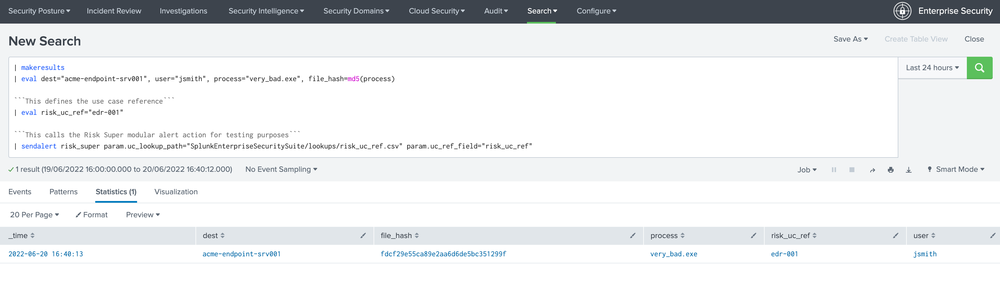
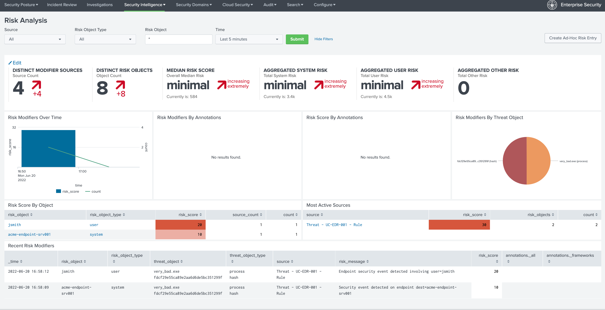
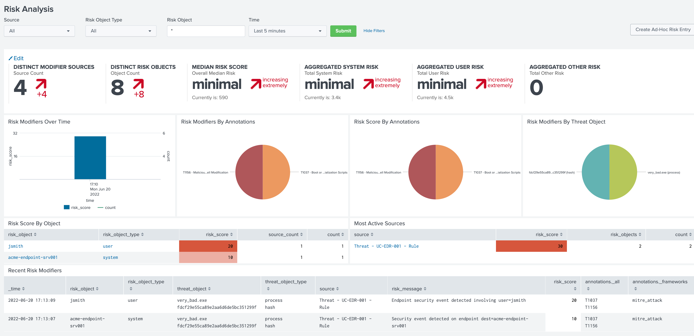

Installation, configuration and usage
-------------------------------------

Installation
#############

- Install the Add-on using supported Splunk deployment methods, either via the UI for a standalone Splunk instance, or via the SHC deployer in a Search Head Context

Create your risk base alerting use case lookup referencial
##########################################################

Risk Base Lookup file requirements
==================================

**Start by creating your Risk Based Alerting referencial lookup file, the CSV file requires two fields:**

- A use case unique reference, you can name the column either way, this should reference uniquely the Risk Rule use case, example: ``risk_uc_id``

- A JSON object defining the Risk Rules for the use case (syntax and options are described below), the name of the column is mandatory called ``json_dict``

**For the purpose of the documentation, the following naming convention is used:**

``risk_uc_ref.csv``

**The Lookup file should be shared at the system level, and can be called in SplunkEnterpriseSecurity application context as:**

::

    | inputlookup risk_uc_ref.csv

JSON Risk Rule definition
=========================

The second field ``json_dict`` is designed to contain the well formed JSON object defining the Risk rules, with the following logic:

- A field ``search_name`` defines the real name of the Risk Rule correlation search, it defines as well the value for the Splunk ``source`` Metadata (handled by the collectrisk command)

- One or more JSON objects define the ``risk_object``, ``risk_object_type``, ``risk_message`` and ``risk_score``

- One or more JSON objects define the ``threat_object`` and ``threat_object_type``

A first JSON Risk definition example
^^^^^^^^^^^^^^^^^^^^^^^^^^^^^^^^^^^^

**Let's assume:**

- Our Risk Rule correlation generates security events for an endpoint, using the CIM convention ``dest``: the risk object value is ``dest``, the type of the risk object is ``system``

- We associate a ``risk_score`` of 10 with this risk object

- Finally, we generate a ``risk_message`` which will be expanded automatically using the ``risk_object`` token

**Our JSON object:**

::

    [{"search_name": "Threat - UC-EDR-001 - Rule"}, {"risk_object": "dest", "risk_object_type": "system", "risk_score": 10, "risk_message": "Security event detected on endpoint dest=$risk_object$"}]

Defining an additional risk object
^^^^^^^^^^^^^^^^^^^^^^^^^^^^^^^^^^^

**Additionally, our Risk Rule correlation search renders a user information, we can complete our JSON rule with an additional JSON object:**

::

    {"risk_object": "user", "risk_object_type": "user", "risk_score": 20, "risk_message": "Endpoint security event detected involving user=$risk_object$"}

**Our JSON definition is now:**

::

    [{"search_name": "Threat - UC-EDR-001 - Rule"}, {"risk_object": "dest", "risk_object_type": "system", "risk_score": 10, "risk_message": "Security event detected on endpoint dest=$risk_object$"}, {"risk_object": "user", "risk_object_type": "user", "risk_score": 20, "risk_message": "Endpoint security event detected involving user=$risk_object$"}]

**If:**

- Any of the risk_object is available as part of Risk Rule correlation search results, a new risk event will be created accordingly

- As we have two risk objects, a single result from the correlation search can potentially lead to the generation of 2 risk events

- Any field available as part of the correlation search result, is available in the risk event too

Defining the threat objects
^^^^^^^^^^^^^^^^^^^^^^^^^^^

**As for the risk objects, we can have one of more combinations of threat objects, for example:**

- Our correlation search renders a process value, the ``threat_object`` is ``process``, the ``threat_object_type`` is ``process`` (the first is the value, the second the category)

- In addition, it renders the hash value of the process, the ``threat_object`` is ``file_hash``, the ``threat_object_type`` is ``hash``

**Each threat JSON object will look like:**

*the first threat object:*

::

    {"threat_object_field": "process", "threat_object_type": "process"}

*the second threat object:*

::

    {"threat_object_field": "file_hash", "threat_object_type": "hash"}

**Our final JSON definition is now:**

::

    [{"search_name": "Threat - UC-EDR-001 - Rule"}, {"risk_object": "dest", "risk_object_type": "system", "risk_score": 10, "risk_message": "Security event detected on endpoint dest=$risk_object$"}, {"risk_object": "user", "risk_object_type": "user", "risk_score": 20, "risk_message": "Endpoint security event detected involving user=$risk_object$"}, {"threat_object_field": "process", "threat_object_type": "process"}, {"threat_object_field": "file_hash", "threat_object_type": "hash"}]

**Let's pretty print:**

::

    [{
        "search_name": "Threat - UC-EDR-001 - Rule"
    }, {
        "risk_object": "dest",
        "risk_object_type": "system",
        "risk_score": 10,
        "risk_message": "Security event detected on endpoint dest=$risk_object$"
    }, {
        "risk_object": "user",
        "risk_object_type": "user",
        "risk_score": 20,
        "risk_message": "Endpoint security event detected involving user=$risk_object$"
    }, {
        "threat_object_field": "process",
        "threat_object_type": "process"
    }, {
        "threat_object_field": "file_hash",
        "threat_object_type": "hash"
    }]

**Note:**

- You can fill the lookup in pretty print format

**Lookup overview in the Splunk app for Lookup Fil Editing:**



Our final lookup referencial
^^^^^^^^^^^^^^^^^^^^^^^^^^^^

**Finally, our lookup is now:**

::

    risk_uc_ref,json_dict
    edr-001,[{"search_name": "Threat - UC-EDR-001 - Rule"}, {"risk_object": "dest", "risk_object_type": "system", "risk_score": 10, "risk_message": "Security event detected on endpoint dest=$risk_object$"}, {"risk_object": "user", "risk_object_type": "user", "risk_score": 20, "risk_message": "Endpoint security event detected involving user=$risk_object$"}, {"threat_object_field": "process", "threat_object_type": "process"}, {"threat_object_field": "file_hash", "threat_object_type": "hash"}]

**Complete the lookup with all Risk Rule correlation searches.**

JSON consistency
^^^^^^^^^^^^^^^^

**It is recommended to verify the consistency of the JSON object before saving changes in the referencial lookup:**

- https://jsonlint.com/

**What if the JSON object definition is inconsistent?**

If for some reasons, the JSON is not well formated, the backend will raise an exception, example:

::

    ERROR risksuperhandler.py stream 254 Failure to load the json object, use case uc_ref_field="edr-003", exception="Expecting ',' delimiter: line 1 column 211 (char 210)"

.. hint::

    - If you are using the streaming custom command, the Risk Super handler will not modify the output of the search
    - If an exception is raised for some reasons, it will not prevent the output of the search to avoid affecting use cases

Using the Risk Super alert action
#################################

Super Risk modular alert action
===============================

Enabling the alert action at the Risk Rule correlation search level
^^^^^^^^^^^^^^^^^^^^^^^^^^^^^^^^^^^^^^^^^^^^^^^^^^^^^^^^^^^^^^^^^^^

Now that we have configured our RBA lookup, the ``Risk Super`` alert action needs to get called at the Risk Rule correlation level, this gets configured via the Correlation Search Editor providing 2 information:

- ``uc_ref_field`` which defines the name of the field containing the use case reference in both the correlation search results and the use case lookup referencial

- ``uc_lookup_path`` which defines the Splunk home relative system path to the lookup file

**For example, in our case:**

- ``uc_ref_field``: ``risk_uc_ref``

- ``uc_lookup_path``: ``SplunkEnterpriseSecuritySuite/lookups/risk_uc_ref.csv``

**And that's it! The entire knowledge is contained in the lookup file, from the Splunk UI this looks like:**

.. image:: img/risk_super_alert_action001.png
   :alt: risk_super_alert_action001.png
   :align: center
   :width: 800px
   :class: with-border

Calling the alert action manually for testing purposes
^^^^^^^^^^^^^^^^^^^^^^^^^^^^^^^^^^^^^^^^^^^^^^^^^^^^^^

**You can call the alert action manually, for the testing or verification purposes, with our example:**

::

    | makeresults
    | eval dest="acme-endpoint-srv001", user="jsmith", process="very_bad.exe", file_hash=md5(process)

    ```This defines the use case reference```
    | eval risk_uc_ref="edr-001"

    ```This calls the Risk Super modular alert action for testing purposes```
    | sendalert risk_super param.uc_lookup_path="SplunkEnterpriseSecuritySuite/lookups/risk_uc_ref.csv" param.uc_ref_field="risk_uc_ref"    

**What this looks like:**



**Locate the execution logs:**

The internal log of the modular alert execution are indexed automatically in the ``cim_modactions``:

::

    index="cim_modactions" sourcetype="modular_alerts:risk_super"

You can change the logging level, which defaults to ``INFO``, either by deploying a local/ta_risk_superhandler.conf:

::

    [logging]
    loglevel = INFO

You can as well make the application visible (go in Manage applications then edit properties), then access the application configuration page.

**If everything was configured properly, you will find 2 risk events newly created:**

::

    index=risk source="Threat - UC-EDR-001 - Rule"

*What this looks like:*

.. image:: img/risk_events_demo001.png
   :alt: risk_events_demo001.png
   :align: center
   :width: 1400px
   :class: with-border

**Let's use the datamodel now:**

::

    | from datamodel:"Risk"."All_Risk" | search source="Threat - UC-EDR-001 - Rule" | table _time, risk*, threat*

*What this looks like:*

.. image:: img/risk_events_demo002.png
   :alt: risk_events_demo002.png
   :align: center
   :width: 1400px
   :class: with-border

*Shortly after, in the Risk Analysis UI:*



*Note that we don't have any annotation available yet, this is because we haven't created yet a proper correlation search, so our search_name does not lead to any annotation, let's create a proper correlation search and sets some random MITRE technics:*

.. image:: img/risk_events_demo004.png
   :alt: risk_events_demo004.png
   :align: center
   :width: 1400px
   :class: with-border

*When it was executed at least once, we can now see the annotations:*

.. image:: img/risk_events_demo005.png
   :alt: risk_events_demo005.png
   :align: center
   :width: 1400px
   :class: with-border

*In the Risk UI:*



**All good!**

Using the Risk Super Handler custom command
###########################################

**Similarly to the Risk Modular Alert action, you can call a streaming custom command to trigger the risk creation, as part of your search results.**

This custom command is called ``risksuperhandler`` and behaves entirely as the modular alert action does.

*In our correlation search example, this would be:*

::

    | makeresults
    | eval dest="acme-endpoint-srv001", user="jsmith", process="very_bad.exe", file_hash=md5(process)

    ```This defines the use case reference```
    | eval risk_uc_ref="edr-001"

    ```This calls the Risk Super modular alert action for testing purposes```
    | risksuperhandler uc_lookup_path="SplunkEnterpriseSecuritySuite/lookups/risk_uc_ref.csv" uc_ref_field="risk_uc_ref"    

*Execution logs will be available in:*

::

    index=_internal sourcetype="risk:superhandler"

.. image:: img/risk_events_demo007.png
   :alt: risk_events_demo007.png
   :align: center
   :width: 1400px
   :class: with-border

**Which leads to the exact same results in the Risk index, Datamodel and UI.**

Additional options
##################

**The risksuperhandler custom command provides the following additional options compared to the modular alert:**

uc_svc_account
==============

You can use this option to avoid generating risks when the custom command is called unless the user running the command matches this value.

For instamce:

::

    | risksuperhandler risk_super uc_lookup_path="SplunkEnterpriseSecuritySuite/lookups/risk.csv" uc_ref_field="risk_uc_ref" uc_svc_account="svc-siem"

Will only generate risk events if the user username equals to "svc-siem", allowing to prevent the risk generation unless the use case is run by the proper user (a good practice is to re-assign correlation searches to a dedicated Splunk service account!)


Multivalue and string delimited fields
======================================

Single and Multivalue fields
^^^^^^^^^^^^^^^^^^^^^^^^^^^^

**The risk objects value fields, as well as the threat object value fields can be:**

- Single value fields
- Multivalue value fields (as from the results of a stats values(<myfield>))

These will be treated transparently, and lead to the creation of risk events accordingly.

Multivalue fields stored in a single value field using a delimiter
^^^^^^^^^^^^^^^^^^^^^^^^^^^^^^^^^^^^^^^^^^^^^^^^^^^^^^^^^^^^^^^^^^

Alternatively, you can define risk object fields and/or threat object fields to be stored in a string delimited format which get expanded as multivalue fields, for instance, let's assume that as part of the search results, the ``user`` field is like:

::
    
    jsmith|jdoe|bfoo|jbar

You can specify in the Risk definition rule, the special option ``format_separator`` with the delimiter, the backend will automatically convert this into a Python list, and handle each value as in a multi-value context:

::

    {"risk_object": "user", "risk_object_type": "user", "risk_score": 20, "risk_message": "Endpoint security event detected involving user=$risk_object$", "format_separator": "|"}

*Let's consider the following example, which mixes this plus multivalue fields:*

::

    | makeresults
        | eval dest="acme-endpoint-srv001", user="jsmith", process="very_bad.exe", file_hash=md5(process)
    | append [ | makeresults
        | eval dest="acme-endpoint-srv001", user="jdoe", process="very_silly.exe", file_hash=md5(process) ]
        
    ```Simulate```
        
    | stats values(user) as user, count, values(process) as process, values(file_hash) as file_hash by dest

    ```This will be a string delimited format```
    | eval user=mvjoin(user, "|")

    ```This defines the use case reference```
    | eval risk_uc_ref="edr-003"

*Which leads to the creation of risk events:*

.. image:: img/risk_events_demo008.png
   :alt: risk_events_demo008.png
   :align: center
   :width: 1400px
   :class: with-border

*The same can be achieved for threat objects, example:*

::

    {"threat_object": "file_name", "threat_object_type": "file", "format_separator": "|"}

Troubleshoot
############

Logging level
=============

All components honour a logging level that can be configured at the application level:

*default/ta_risk_superhandler.conf:*

::

    [logging]
    loglevel = INFO

You can enable the ``DEBUG`` mode to get a deep debug of each step of the execution by publishing a local version of this file.

You can as well make the application visible (go in Manage applications then edit properties), then access the application configuration page.

.. image:: img/logging_level_001.png
   :alt: logging_level_001.png
   :align: center
   :width: 1400px
   :class: with-border

Alert action modular alert logs
===============================

The logs resulting from the modular alert are available at:

::

    index="cim_modactions" sourcetype="modular_alerts:risk_super"

Streaming custom command Risk Super Handler
===========================================

The logs resulting from the modular alert are available at:

::

    index=_internal sourcetype="risk:superhandler"

riskjsonload generating custom command
======================================

The riskjsonload generating custom command is used to load the resulting JSON and submit to the collectrisk command from Splunk Enterprise Security, logs are available at:

::

    index=_internal sourcetype="risk:jsonload"
